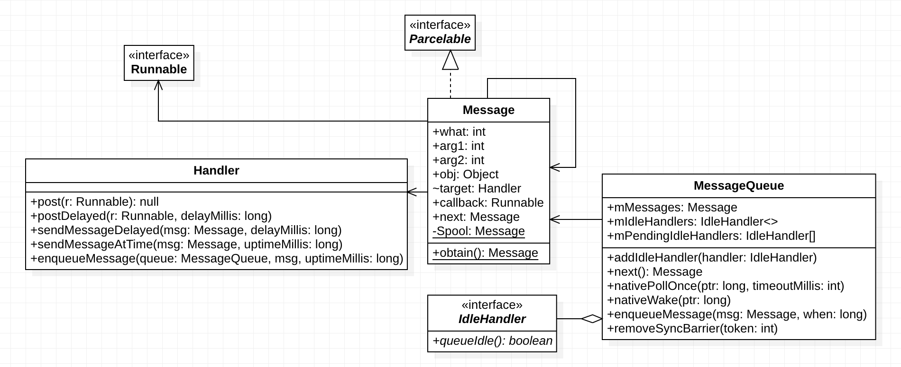
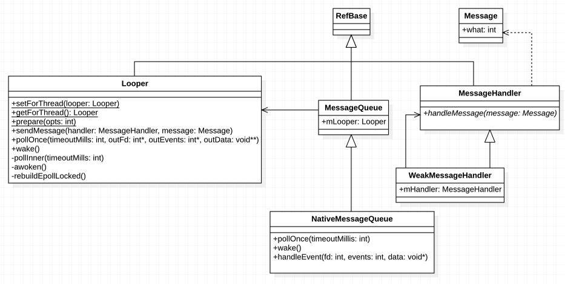

# 一 消息机制

## 1.1 java层



## Message 

消息体，链表结构

每个Message都会绑定一个Handler作为target

Message维护了一个静态的sPool作为消息池，通过obtain方法复用回收的message

### MessageQueue

消息队列

`mMessages`成员为消息队列, 按时间升序排列

`mIdleHandlers`成员为IdleHandler列表，一个List

`next()`方法用来提取一条消息

当最近的一条消息也是延迟消息时,调用 `nativePollOnce`方法阻塞等待

`nativePollOnce`方法会完成一次native层的消息轮询

如果链表头的消息已经到达触发时间,则返回该消息

否则计算延迟时间，执行所有IdleHandler

如果执行了IdleHandler,从新轮询链表头，否则阻塞等待

`enqueueMessage`在合适位置插入一条消息

如果插入到链表头，则唤醒线程

唤醒线程通过nativeWake方法，以mPtr表示唤醒那个线程。该值有nativeInit方法产生

同步消息插入链表中部，不唤醒线程

异步消息插入链表中部，且链表头是同步栅栏，唤醒线程


## Handler

最终都会执行sendMessageAtTime方法，再往下是 enqueueMessage方法，转调MessageQueue的enqueue

最终消息会通过dispatch方法被分派给自己

如果callback成员不为空，说明是一个Runnable则执行run方法

如果mCallback成员不为空，说明是一个Callback对象，执行起handleMessage方法

否则执行`Handler#handleMessage`方法


## Looper

消息泵,每个线程最多有一个

私有构造方法 + ThreadLocal 确保线程唯一

loop方法死循环，从messagequeue中取消息

取出消息后，将消息dispatch给其target

之后回收消息


### 异步消息 & 同步屏障

消息默认均为同步消息 

调用`setAsynchronous`方法会将消息设置为异步消息

`MessageQueue#postSyncBarrier()`方法会向messageque最前端插入一个同步屏障

有了同步屏障之后，`MessageQueue#next()`只会返回屏障后面的异步消息，而忽略所有同步消息

异步消息同样要遵守时间约定，没到到达预定时间时，消息队列会阻塞

`MessageQueue#removeSyncBarrier`会移除一条同步屏障,根据token

postSyncBarrier是hide方法，只在`VRI#scheduleTraversals`进行了调用。目的提高UI刷新相关message的优先级


## 1.2 native层



### 1.2.1 启动阶段

java层Looper创建时，会创建java MessageQueue, MessageQue创建时会调用nativeInit()

nativeInit()会创建NativeMessageQueue

NativeMessageQueue创建时，会确保一个Looper在TLS中(native的Looper也是线程唯一)

Looper创建时,先重置唤醒文件描述符mWakeEventFd(eventFd()),再执行rebuildEpollLocked方法,此方法

* 重置epoll文件描述符mEpollFd(epoll_create)
* 将mWakeEvendFd添加至mEpollFd的监听(epoll_ctl)
* 也会将一些其他fd加入监听


### 1.2.2 阻塞阶段

java层MessageQueue#next()会调用nativePollOnce()进入阻塞等待

nativePollOnce->NativeMessageQueue#pollOnce->Looper#pollOnce->pollInner

pollInner调用epoll_wait进入阻塞等待，等待管道读端可读


### 1.2.3 唤醒阶段

java#nativeWake->NativeMessageQueue->wake()->Looper#wake()

Looper#wake()通过write方法向mWakeEventFd写入内容“1”

管道中有内容可读，epoll_wait会结束阻塞,Looper#PollInner方法得以继续

如果是mWakeEventFd,通过awoken方法从管道中将数据读出清空

如果当前native消息队列不为空，则轮询执行所有native消息

如果reponse不为空，则轮询执行所有reponse

之后java线程得以继续


### 1.2.4 native消息的来源

Surfaceflinger/Audio/Choreographer/InputDispatcher...

均有对Looper#sendMessage的调用


# 二 Binder


# 三 Apk打包

## 3.1 打包流程

* 生成R文件

  输入: 各资源文件

  工具: aapt (Android Asset Packaing Tool)

  输出: R.java, resource.arsc

  资源文件会分配 id，放在resource.arsc文件中。该文件记录了id与对应xml文件的对应关系

* aidl生成.java

  输入: 各aidl文件

  工具: aidl

  中间会生成对应的.stub/.proxy类。如果没有用到aidl，则跳过此步骤

* 生成class文件

  输入: 各java文件，包括前两步生成的java

  工具: javac

  标准的javac编译器动作，生成.class文件,位于工程bin/classes目录

* 生成dex文件

  输入: 各class文件

  工具: dx

  三方lib中的class文件也会在这一步被转换成dex

  dex文件可以压缩常量池，消除冗余信息，减少最终apk大小

* 生成apk文件

  输入: 位图、asset目录、dex文件

  工具: apkbuilder

  此时apk尚未签名

* 签名

  输入: 生肉apk

  工具: jarsigner、apksigner

* 对齐

  输入: 已签名apk

  工具: zipalign

  以4的倍数进行对齐，加快访问速度

## 3.2 签名

### 3.2.1 v1签名

支持版本: Android6.0及以前

签名工具: `jarsigner`

签名文件: META-INF目录，三个文件: MANIFEST.MF, CERT.SF, CERT.RSA

MANIFEST.MF： 对所有文件生成摘要(SHA1)

CERT.SF： 对MANIFEST.MF及文件中的内容进行二次摘要(SHA1)

CERT.RSA: 使用私钥对CERT.SF进行签名, 签名+公钥(数字证书)放入CERT.RSA中

验证: 使用公钥对签名进行解密，得到摘要，根据摘要依次比对各文件是否经过修改

### 3.2.2 v2签名


支持版本: Android7.0及以上

在apk(zip)文件中新增了`apk签名块`数据区域，用于存放签名信息

### 3.2.3 v3签名

支持版本: Android9.0及以上

支持apk秘钥轮替。及可以更新签名。但是要使用旧的签名为新签名担保


# 四 dex文件

## 4.1 dex文件结构

## 4.2 multidex

### 4.2.1 multidex的原因

### 4.2.2 不分dex直接加载会不会有问题


# 五 View

## 5.1 measure layout & draw

## 5.2 事件分发


### View#dispatchTouchEvent

touchLister#onTouch ? 已消费 : onTouchEvent

onTouchEvent ? 已消费 : 未消费

onTouch: 在DOWN中抛一个延迟runable触发LongClickListener。在UP中出发ClickListener(如果没触发LongClick)


## 5.3 requestLayout 

## 5.4 invalidate


# 六 Context

## 6.1 Context的种类


# 七 Activity

## 7.1 启动流程


# 八 Window


# 九 性能

## 9.1 内存

### 9.1.1 工具 & 原理

### 9.1.2 LeakCanary原理


# 十 BroadCast

## 10.1 静态 & 动态

## 10.2 粘性 & 非粘性

## 10.3 优先级


# 十一 虚拟机

## 11.1 Dalvik

## 11.2 ART


## 十二 屏幕适配


# 十三 gradle

循环依赖会有问题吗，如何解决


# 十四 Service

## 14.1 生命周期

## 14.2 startService

## 14.3 bindService


# 十五 ContentProvider


# 十六 序列化

## 16.1 Serializable

## 16.2 Parcelable


# 三方库

## Retrofit


# Android版本更新

## Android 12

### 所有应用

* 优化沉浸模式下手势导航

* 前台服务通知延迟: 延迟10s再展示前台服务通知
* 限制mac地址访问. target31返回null,其他返回占位符

### target=31

* 后台应用禁止启动前台service
* 无法在service、广播中startActivity
* 使用IntentFilter的Activity/Service/BroadcastReceiver必须显示指明export

## Android 11

### target=30

* 强制分区存储
* 自动重置权限,长时间未使用的应用重置敏感权限
* 必须在系统设置页面,才能授权后台位置访问权限
* 软件包可见性。从获取安装列表，改为提供列表向系统查询哪些存在
* 无法安装仅使用v1签名的应用

### 所有应用

* 单次授权。位置/麦克风/摄像头可以临时设置权限
* 用户拒绝某项权限增加”不在询问“选项
* 针对5G的模拟器

## Android 10

### target=29

* 分区存储 （非强制）

  * 非强制, 在Manifest中声明```requestLegacyExternalStorage```可规避

  * 内部存储空间

    本应用专属```getFilesDir```

    ```/data/data/package_name/```

    ```/data/user/0/package_name/```

    其他应用无论如何不能访问

  * 外部存储空间

    本应用专属空间 ```getExernalFilesDir```

    其他应用需要权限才能访问

    ```/storage/emulated/0/Android/data/package_name/```

* 后台启动activity限制

* 不能获取序列号 & IMEI

* WLAN/BT扫描需要FINE_LOCATION权限

### 所有应用

* 限制非sdk接口使用 (反射)

  * 黑名单

    禁止访问，访问则抛出异常

  * 灰名单

    暂时还可以用

  * 白名单

    公开api,可正常使用


# 调试工具

## Android Size Analyzer


# 性能调优

MemoryLeak原理


65536个方法的原因


# Messenger


# Parcelable VS Serialized

