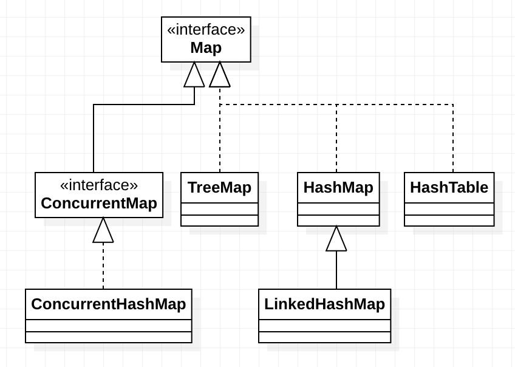
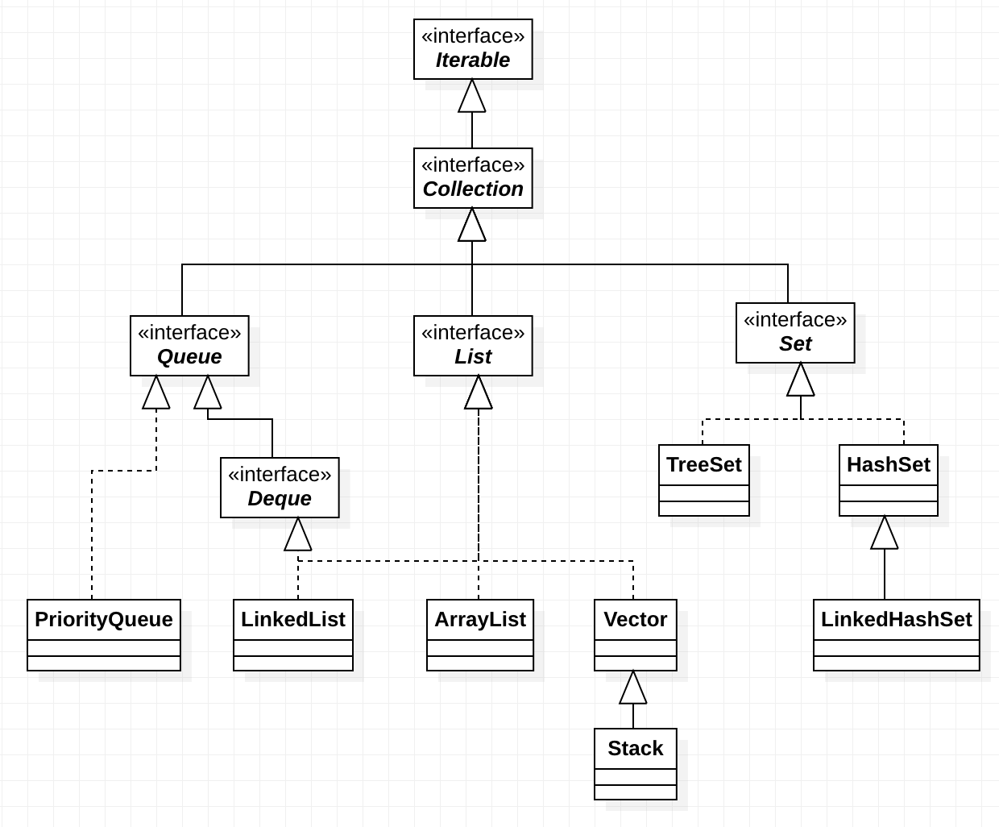
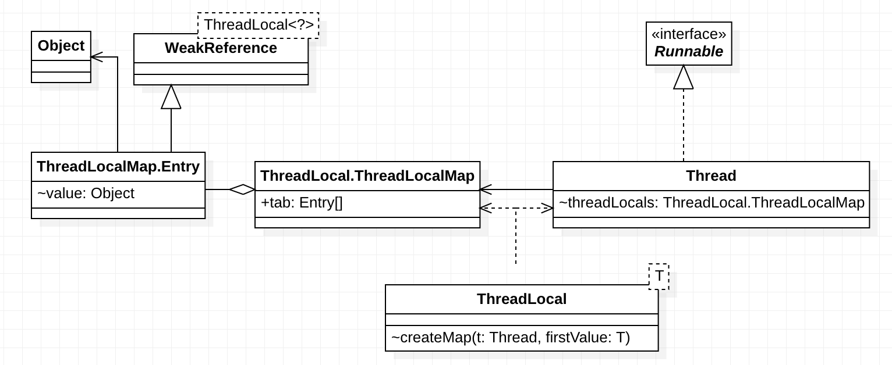
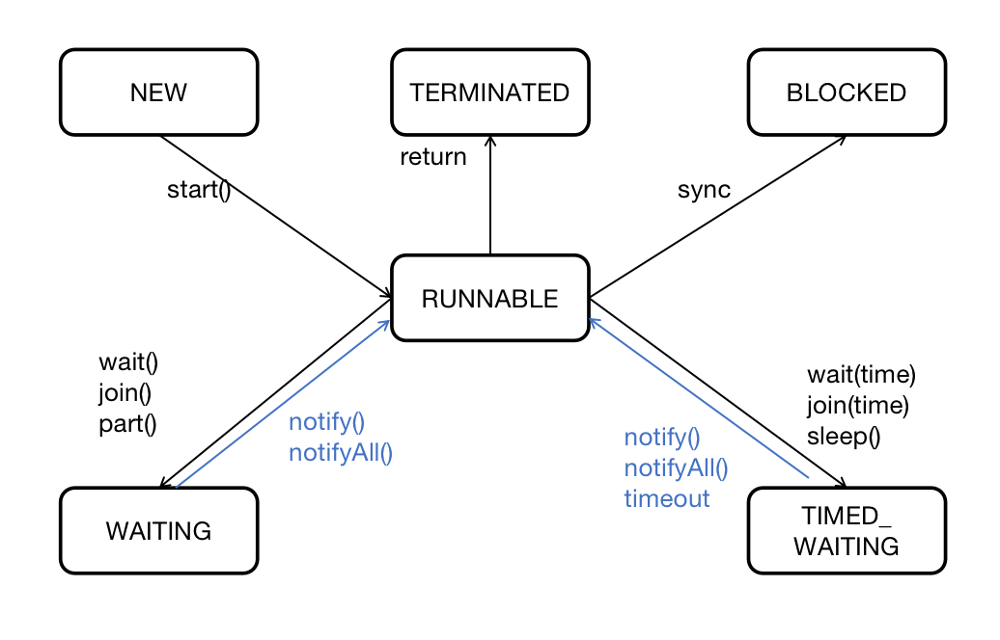
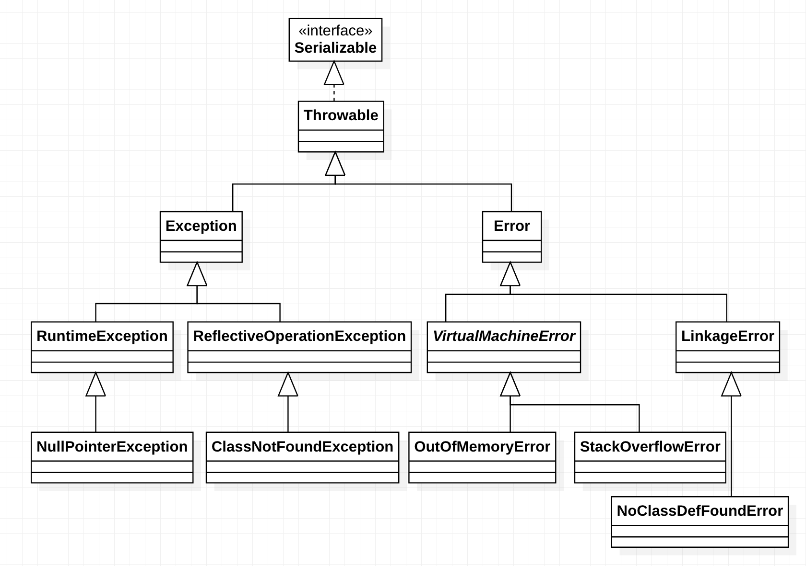

switch: byte short char int enum String


* final finally finalize

  * final

    修饰类: 不可被继承

    修饰方法: 不可被重写

    修饰变量: 不可改变引用的指向

  * finnaly

    Try-catch-finnaly 一定会被执行

  * finalize

    Object的一个方法,当对象被认定为垃圾时,会调用该方法

# 一 类与对象

## 1.1 Object

### 1.1.1 hashCode方法

​		用于散列，
​		唯一要求: 相同的对象必须有相同的散列码
​		提升性能: 为不同对象生成不同的散列

### 1.1.2 equals方法

* 重写原则

对称性、传递性、一致性

```java
		    public boolean equals(Object anObject) {
		        if (this == anObject) {
		            return true;
		        }
		        if (anObject instanceof String) {
		            String aString = (String)anObject;
		            if (!COMPACT_STRINGS || this.coder == aString.coder) {
		                return StringLatin1.equals(value, aString.value);
		            }
		        }
		        return false;
		    }
```

* 为什么重写equals必须重写hashCode？

参考hashCode唯一要求

* equals vs ==

equals: 两个对象内容是否相等; 默认内部是 ==

==: 两个基本数据是否相等; 两个引用是否指向同一对象

## 1.2 内部类

### 1.2.1 内部类为什么能访问外部类私有成员

### 1.2.2 外部内为什么能访问内部类私有成员


# 二 String

String str = "abc";

str是引用, 存放在虚拟机栈

”abc"是常量，存放在方法区常量池

String str = new String("abc");

在堆上重新分配一块内存，其内容是从方法区中的"abc"常量copy而来

|            | String | StringBuffer | StringBuilder |
| ---------- | ------ | ------------ | ------------- |
| 不可变对象 | Y      | N            | N             |
| 线程安全   | Y      | Y            | N             |


#  三 MAP




## 3.1 HashMap

### 3.1.1 特性

元素无序, key允许传null, key=null则hash=0

loadFactor = DEFAULT_LOAD_FACTOR = 0.75f

DEFAULT_INITIAL_CAPACITY = 1 << 4 = 16

### 3.1.2实现

数字+链表 或 数组+红黑树

TREEIFY_THRESHOLD = 8. 链表长度>8,则转换为红黑树

### 3.1.3 散列过程

* 散列值: 

```java
static final int hash(Object key) {
    int h;
    return (key == null) ? 0 : (h = key.hashCode()) ^ (h >>> 16);
}
```

hash算法: i = (n - 1) & hash. 

允许key=null, key=null则hash=0

hashCode高低16位的按位异或,

* 散列至槽:

```java
i = (n - 1) & hash]
```

n是数组长度(槽的个数),hash是散列值

### 3.1.4 扩容 resize()

```java
newCap = oldCap << 1
```

每次扩容一倍, 该方法为final方法,无法重写,也就无法修改扩容逻辑

## 3.2 LinkedHashMap

继承自HashMap

元素有序(插入顺序或反问顺序)，HashMap+双向链表实现

可实现LRU


## 3.3 HashMap vs HashTable

| 表头     | HashMap | HashTable | TreeMap |
| -------- | ------- | --------- | ------- |
| 线程安全 | N       | Y         | N       |
| 允许null | Y       | N         | N       |
| 有序     | N       | N         | Y       |

# 四 Collection



## 4.1 Set

任意两个元素不相等，最多含有一个null

### 4.1.1 HashSet

内部有一个HashMap，数据存放在HashMap的key属性里，value统一使用名为PRESENT的Object对象


## 4.2 List

允许元素相等，如果允许null则允许多个null. 


## 4.3 Queue


## 4.4 TreeXX

Tree前缀表示该容器中的元素是有序的,基于红黑树实现


## 4.5线程安全的容器

Vector、 Stack、HashTable

ConcurrentXXX java.util.concurrent 包下面的容器


# 五 Thread相关

## 5.1 ThreadLocal



* ThreadLocalMap

  一个hashMap, 基于数组实现, 采用开放寻址法

  寻址方法:

  ```java
          private void set(ThreadLocal<?> key, Object value) {
              int i = key.threadLocalHashCode & (len-1);
              //...
          }
  ```

* Thread#threadLocals

  ThreadLocalMap的实例对象,包访问权限，作为Thread的一个成员

  但是其创建是在ThreadLocal#createMap()方法中

  

## 5.2 线程 

### 5.2.1 线程

CPU调度的最小单位

* 创建

  继承Thread, 重写run()。调用 start() 启动线程

  实现Runnable,重写run()，作为构造参数创建Thread对象，调用start()启动线程

  无论如何，只能调用start()启动新线程.调用run()只会在当前线程执行run()

* 线程状态

  * NEW

    尚未启动的线程

  * RUNNABLE

    正在执行run方法的线程,即使在等待其他资源(例如IO), JVM也认为它处于RUNNABLE状态

  * BLOCKED

    在等待一个锁,和锁有直接关系

  * WAITING

    在等待其他线程的特定动作,和锁无直接关系

  * TIMED_WAITING

    与WAITING相同, 只是多了个时间限制

  * TERMINATED

    已经执行结束



### 5.2.2 wait & notify

`wait & notify是Object的方法, 不是Thread的方法`

每个对象都有一个wait集合,存放在wait该对象的所有线程

* wait

  只有拥有对象锁的线程，才能执行该对象的wait方法

  执行wait会阻塞线程，同时释放锁

  被通知之后wait解除，此时需要重新尝试获取对象锁

* notify

  只有拥有对象所的线程,才能执行notify方法

  notify后本线程并不释放锁，只有同步代码正常走完之后才释放锁

  notify会在该对象的wait线程集合中选择一个解除wait

  选择规则没有约定

* notifyAll

  执行原则同notify

  执行后果是所有wait线程都会解除wait,然后重新竞争对象锁

* wait vs sleep vs yield

  wait会释放对象锁

  sleep不会释放任何锁
  
  yield 不会释放任何锁.向调度器建议本线程可以暂停执行,让出CPU。具体是否暂停和让出，取决于调度器

### 5.2.3 interrupt


## 5.3 线程池 & 线程池状态转移图


## 5.4 线程同步与安全

原子性、可见性、有序性


### 5.4.1 synchroized vs volitale

* synchronized

  synchronized语句块锁一个对象

  synchronized实例方法，锁方法里的this

  synchronized静态方法，锁方法对应的Class

  基于monitor实现,无论方法调用还是同步语句块。任何对象都有一个monitor与之关联,monitor有一个计数器

  monitorenter/exit用来实现synchronized语句块

  * monitorenter

    当monitor=0时,可进入monitor;monitor可重入，每次monior+=1

    当monitor>0时,monitorenter被阻塞,直到monitor=0

  * monitorexit

    每次执行,monitor-=1,直到monitor=0,其他线程可以获取monitor

  * 方法调用时,自动进入monitor,返回时自动退出monitor。方法调用/返回指令中隐式处理

  * synchronized语句块与方法在异常发生时处理方法不同

    * 正常完成,通过jvm返回指令退出monitor; 非正常时,通过athrow指令退出monitor
    * 语句块: jvm异常处理机制保证退出语句块开始时的monitor

* volitale

  通过试工作内存中的变量副本失效


### 5.4.2 Lock & ReentrantLock


### 5.4.3 atomic

### 


#  六 反射

## 6.1 什么是反射

## 6.2 java序列化 vs Android 序列化

## 6.3 动态代理及场景

Retrofit

## 6.4 克隆

### 6.4.1 Object#clone()

### 6.4.2 序列化 & 反序列化

## 6.5 深拷贝 VS 浅拷贝


# 七 异常



## 7.1 exception vs error vs throwable

* Error

  严重问题，应用不应该尝试catch.例如内存不足

* Exception

  应用本身导致的问题,应用应该catch并解决

### 7.1.1 受检异常 vs 运行时异常

* RuntimeException

  RuntimeException及其子类,运行时才能发现,

  可以被忽略, e.g NPE

* CheckedException

  所有非RuntimeExcpetion类型的异常,

  不能被忽略, 必须被catch或者继续抛出, e.g IOException

  如果继续抛出,则必须在method签名中声明

  在编译器能够发现此类异常
  
  在class文件中，会有一个Exceptions位于method_Info的属性表中,描述了改方法可能抛出的受检异常

### 7.1.2 NoClassDefFoundError vs ClassNotFoundException

* NoClassDefFoundError

  一个Error,继承自LinkageError

  JVM或者ClassLoader尝试加载一个class,而这个class不存在时发生

  该class在编译阶段是没问题的，在运行时找不到

  一个可能的原因是运行在另外JVM实例时, CLASS_PATH设置有误

* ClassNotFoundException

  一个检查型异常,继承自ReflectiveOperationException,进行反射操作时发生

  使用Class#forName(), ClassLoader#findSystemClass(), ClassLoader#loadClass()时找不到指定的类

## 7.2 throw vs throws

* throw

  一个动作,向外抛出一个异常

* throws

  一个声明, 本方法可能抛出如下异常,调用者需要处理

## 7.3 try-catch-finnally


# 八 嵌套类

## 8.1 嵌套类

生命出现在其他类体或接口中的类。

只和代码出现的位置有关。和是否static、public无任何关系。

## 8.2 内部类

没有static修饰的嵌套类，包括: 非static成员类、局部类、匿名类。

接口的成员类是隐式static，因此不是内部类


## 8.3 private的访问

java语言规范6.6.1 确定可访问性：如果成员/构造器是private,那么访问是允许的,当且仅当它出现在包围着该成员/构造器生命的顶层类类体内部

通俗的说，对于private修饰的成员/放在，只要在本calss文件中，都是可访问的。无论是内部类访问外部类，还是外部类访问内部类，或者有static修饰


